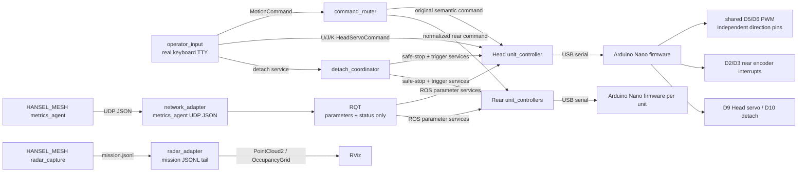

# ROS 2 system architecture

## Package responsibilities

- `hansel_operator`: keyboard input, semantic routing, detach coordination and
  parameter-only RQT.
- `hansel_unit_control`: semantic-to-CPS mapping, safety/watchdog,
  feed-forward/PID/ramp and Dummy/Nano hardware adapters.
- `hansel_network_adapter`: original metrics-agent UDP JSON to ROS status and
  optional detach recommendation.
- `hansel_radar_adapter`: original mission-log `radar_frame` to ROS cloud/map.
- `hansel_bringup`: single-PC dummy launch, operator launch, per-unit launch and
  adapter launch.
- `firmware`: physical Nano pin control and serial watchdog.
