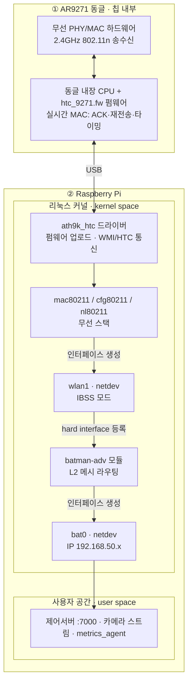
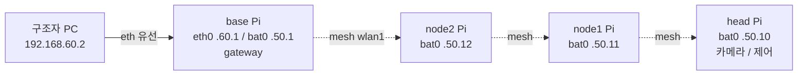

# HANSEL_MESH 아키텍처

## 1. 프로토콜 스택 (한 노드)

두 개의 **물리 박스**(AR9271 칩 / 라즈베리 파이)로 나뉘고, USB로 연결된다.
각 박스 안에서 도는 프로세스와, 파이 안의 계층(kernel space / user space)을
구분한다.

**박스별로 무슨 프로세스가 도나:**

| 물리 박스 | 계층 | 실행 주체 | 역할 |
| --- | --- | --- | --- |
| ① 칩(동글) | 무선 하드웨어 | AR9271 | 2.4GHz 송수신 |
| ① 칩(동글) | 펌웨어 | 동글 내장 CPU | **실시간** 802.11 MAC (호스트가 USB 너머로 실시간 제어 불가) |
| ② Pi 커널 | 드라이버 | ath9k_htc | 펌웨어 업로드, USB↔칩 통신 |
| ② Pi 커널 | 무선 스택 | mac80211/cfg80211 | `wlan1` netdev 생성 |
| ② Pi 커널 | netdev | wlan1 | IBSS 무선 링크 |
| ② Pi 커널 | 메시 라우팅 | batman-adv | `wlan1` 입력 → `bat0` 생성 |
| ② Pi 커널 | netdev | bat0 | end-to-end IP |
| ② Pi 유저 | 애플리케이션 | 제어/영상/모니터 | `bat0` 위에서 통신 |

> 핵심 layer 원칙:
> - **칩 안**은 펌웨어가 실시간 무선을 전담(USB 지연 때문). **파이 안**은 커널이
>   드라이버~batman까지, 유저공간이 앱.
> - batman-adv는 hard interface(`wlan1`)만 안다. AR9271/ath9k_htc를 직접 부르지 않는다.
> - IP는 `bat0`에만. `wlan1`(무선)에는 부여하지 않는다.

## 2. 물리 토폴로지

- **실선** = 유선(관리망), **점선** = BATMAN 무선 메시
- 모든 Pi가 릴레이 라우터. 중간 노드는 앱을 열지 않고 프레임만 포워딩
- 내장 `wlan0`은 mesh에서 빠져 있고, 향후 조난자 핸드폰 AP 등에 사용

## 3. 통신 흐름

- **제어**: PC → base `bat0` → 메시 next-hop → head/node 제어서버(:7000)
- **영상**: head 카메라 → `bat0` → 메시 → base → PC `video_probe`
- **모니터**: 각 노드 `metrics_agent` → base/PC `dashboard`(:7100)

## 4. 관련 문서

- 동글 도착 후 실행: [dongle_arrival_runbook.md](dongle_arrival_runbook.md)
- 재연결 감지/표시: [reconnect_detection.md](reconnect_detection.md)
- 재연결 튜닝: [reconnect_tuning.md](reconnect_tuning.md)
- 네트워크 설계: [network_design.md](network_design.md)
