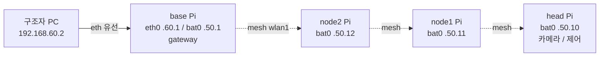

# HANSEL_MESH 아키텍처

## 1. 프로토콜 스택 (한 노드)

AR9271 동글이 batman-adv를 **직접 제어하지 않는다.** 계층이 분리돼 있고,
각 계층이 위 계층에 인터페이스를 올려준다.

계층(소프트웨어)과 그 계층이 만드는 인터페이스(netdev)를 구분한다. USB는
계층이 아니라 버스이므로 화살표로 표시한다.

```mermaid
flowchart TD
    HW["AR9271 동글<br/>내장 CPU가 htc_9271.fw 펌웨어 실행"]
    DRV["ath9k_htc 드라이버<br/>부팅 시 펌웨어 업로드 · USB 통신"]
    MAC["mac80211 / cfg80211 / nl80211<br/>리눅스 무선 스택"]
    WLAN["wlan1 &#40;netdev&#41;<br/>IBSS 모드로 join"]
    BAT["batman-adv 모듈<br/>L2 메시 라우팅"]
    BAT0["bat0 &#40;netdev&#41;<br/>IP 192.168.50.x"]
    APP["애플리케이션<br/>제어 :7000 · 카메라 RTP · 모니터 :7100"]

    HW -->|USB| DRV
    DRV --> MAC
    MAC -->|인터페이스 생성| WLAN
    WLAN -->|hard interface로 등록<br/>batctl if add wlan1| BAT
    BAT -->|인터페이스 생성| BAT0
    BAT0 --> APP
```

- 소프트웨어 계층: `ath9k_htc` → `mac80211` → `batman-adv`
- 그 계층이 만드는 netdev: `mac80211` → `wlan1`, `batman-adv` → `bat0`
- `batman-adv`는 `wlan1`을 **hard interface로 입력받아** `bat0`를 **출력**한다
  (둘 사이에 별도 인터페이스는 없다)

| 계층 | 역할 |
| --- | --- |
| AR9271 + 펌웨어 | 무선 하드웨어의 실시간 802.11 MAC 처리 |
| ath9k_htc | 드라이버. 펌웨어 로딩, USB ↔ 하드웨어 |
| mac80211/cfg80211 | 리눅스 무선 인프라. `wlan1` 인터페이스 생성 |
| wlan1 | IBSS 모드로 join — 여기까지가 "무선 링크" |
| batman-adv | `wlan1` 위의 Layer 2 메시 라우팅. `bat0` 생성 |
| bat0 | 모든 노드 같은 서브넷. end-to-end 통신 |
| 앱 | 데이터는 `bat0` 위에서 흐름 |

> 핵심: batman-adv는 hard interface(`wlan1`)만 안다. AR9271/ath9k_htc를 직접
> 부르지 않는다. IP는 `bat0`에만 부여하고 `wlan1`(무선)에는 부여하지 않는다.

## 2. 물리 토폴로지

- **실선** = 유선(관리망), **점선** = BATMAN 무선 메시
- 모든 Pi가 릴레이 라우터. 중간 노드는 앱을 열지 않고 프레임만 포워딩
- 내장 `wlan0`은 mesh에서 빠져 있고, 향후 조난자 핸드폰 AP 등에 사용

## 3. 통신 흐름

- **제어**: PC → base `bat0` → 메시 next-hop → head/node 제어서버(:7000)
- **영상**: head 카메라 → `bat0` → 메시 → base → PC `video_probe`
- **모니터**: 각 노드 `metrics_agent` → base/PC `dashboard`(:7100)

## 4. 관련 문서

- 동글 도착 후 실행: [dongle_arrival_runbook.md](dongle_arrival_runbook.md)
- 재연결 감지/표시: [reconnect_detection.md](reconnect_detection.md)
- 재연결 튜닝: [reconnect_tuning.md](reconnect_tuning.md)
- 네트워크 설계: [network_design.md](network_design.md)
