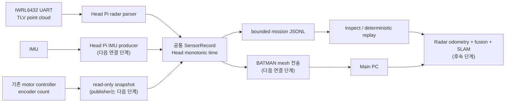

# Phase 1 — Radar·IMU·Encoder 데이터 기반

## 현재 완료 범위

이번 단계는 기존 조종·GPIO·PID 동작을 바꾸지 않고 다음 기반을 추가한다.

- Radar, IMU, wheel encoder, unit drop event, sensor health의 공통 스키마
- Head Pi의 monotonic clock을 기준으로 한 관측 시각·sequence·시간 품질 규칙
- NaN, Infinity, 중복 JSON key, 잘못된 벡터 길이를 거부하는 strict JSON codec
- 크기와 레코드 수가 모두 제한된 비동기 JSONL recorder
- 로그 손상·sequence gap·시간 역행을 검사하는 inspector
- 동일 로그를 무대기 또는 실제 시간 비율로 재생하는 replay
- TI IWRL6432 MMWAVE-L-SDK의 TLV 1, 7, 301 parser
- UART가 임의 chunk로 끊기거나 앞에 쓰레기 byte가 있어도 magic word로 복구하는 stream decoder
- 이미 실행 중인 IWRL6432 UART를 raw `.bin`, chunk 시각 index, mission JSONL로 동시에 저장하는 CLI
- 기존 모터 controller의 누적 encoder count를 변경하지 않고 복사하는 read-only snapshot API

아직 포함하지 않은 항목은 IMU 실제 driver, encoder UDP publisher, Radar/IMU/encoder fusion, Radar SLAM, 카메라와 지도 UI이다. 이 항목들은 실제 센서 로그를 먼저 확보한 뒤 진행한다.

## 데이터 흐름



## 공통 시간축과 식별자

SLAM 입력에서 `time.time()`이나 PC 수신 시각을 센서 시각으로 사용하면 안 된다.

| 필드 | 의미 |
| --- | --- |
| `mission_id` | 한 번의 임무·실험 전체를 묶는 ID |
| `boot_id` | Linux boot UUID. 재부팅 전후 monotonic clock을 구분 |
| `producer_id` | 수집 process를 다시 시작할 때마다 바뀌는 ID |
| `stream_id` | `radar/front`, `imu/body`, `wheel/drive` 같은 논리 stream |
| `seq` | producer·stream별로 1부터 증가 |
| `monotonic_ns` | Head Pi monotonic domain의 관측 시각. 정확도는 아래 두 필드와 함께 판단 |
| `sensor_timestamp_ns` | 센서 자체 시간이 정말 ns 단위일 때만 사용 |
| `wall_time_ns` | 사람이 로그를 찾기 위한 정보. motion 적분에는 사용 금지 |
| `timestamp_source` | `host_capture`, `uart_read_midpoint` 등 시각의 생성 방법 |
| `timestamp_uncertainty_ns` | `timestamp_source`별 시간 품질 추정값. source의 정의 없이 오차 상한으로 해석 금지 |

IWRL6432의 `timeCpuCycles`는 절대 시각도 ns도 아니다. uint32 cycle counter 원본을 `device_time_cycles`에 보존한다. pyserial은 USB/XDS110/UART buffer 안에서 정확히 언제 첫 byte가 도착했는지 알려주지 않으므로, 현재 capture는 각 `read()` 시작·종료 시각의 중간값을 `uart_read_midpoint`로 저장한다. `timestamp_uncertainty_ns`에는 read window, timeout, UART line 전송 시간으로 만든 휴리스틱 시간 품질 척도를 넣는다. 숨은 USB/XDS110 지연을 알 수 없으므로 이 값은 통계적 신뢰구간도 보수적 오차 상한도 아니다. 여러 frame이 한 read에 들어오면 같은 관측 시각을 가질 수 있다.

따라서 이 UART 관측 시각을 곧바로 정밀 IMU fusion의 measurement timestamp로 사용하면 안 된다. 실제 로그에서 `device_time_cycles`를 modulo-2^32로 unwrap하고 Head 관측 시각에 선형 fitting한 뒤, CPU clock 설정과 frame period를 대조해 radar measurement time을 만들어야 한다.

## IWRL6432 parser 기준

TI의 SDK 05.05 문서 본문에는 frame header가 52 bytes라고 적혀 있지만, 같은 문서의 C structure와 TI ROS parser가 사용하는 실제 필드는 `magic 8 bytes + uint32 8개 = 40 bytes`이다. 따라서 기본값은 40 bytes이다. 52는 custom firmware 확인을 위한 명시적 진단 옵션일 뿐이다.

지원 형식:

| TLV | 내용 | payload |
| --- | --- | --- |
| `1` | float Cartesian points | `<ffff>` = x, y, z, radial velocity, 점당 16 bytes |
| `7` | TLV 1의 side info | `<hh>` = SNR, noise, 점당 4 bytes, 0.1 dB/LSB |
| `301` | L-SDK 5.x fixed/compressed Cartesian points | units 20 bytes + 점당 `<hhhhBB>` 10 bytes |

TLV `length`는 8-byte TLV header를 제외한 payload 길이이다. 모르는 TLV는 해당 길이만큼 안전하게 건너뛰고 type과 length만 남긴다. `1020`은 301과 다른 spherical compressed 형식이므로 현재 parser로 해석하지 않는다.

Radar point 수는 고정되지 않는다. 0-point frame도 정상 관측이며 기록한다. 코드의 8192-point 제한은 손상된 packet으로 인한 메모리 폭주를 막는 software safety limit이지 IWRL6432가 항상 그 수를 출력한다는 뜻이 아니다.

공식 근거:

- [TI MMWAVE-L-SDK 05.05 mmWave Demo](https://software-dl.ti.com/ra-processors/esd/MMWAVE-L-SDK/05_05_00_02/exports/api_guide_xwrL64xx/MMWAVE_DEMO.html)
- [TI 공식 ROS mmWave parser](https://git.ti.com/cgit/mmwave_radar/mmwave_ti_ros/tree/ros2_driver/src/ti_mmwave_rospkg/src/DataHandlerClass.cpp)
- [IWRL6432BOOST EVM User Guide](https://www.ti.com/lit/ug/swru596/swru596.pdf)

## Windows에서 hardware 없이 검증

repository root에서 실행한다.

```powershell
python -m unittest discover -s tests -v
python -m sensors --help
python -m sensors demo missions\demo.jsonl
python -m sensors inspect missions\demo.jsonl
python -m sensors replay missions\demo.jsonl --speed 0
```

Windows에서 개발하고 parser·logger·replay를 검증하는 데 문제없다. GPIO와 systemd, 실제 serial device만 Raspberry Pi에서 최종 확인한다.

이미 저장한 UART binary가 있다면:

```powershell
python -m sensors radar-bin captures\iwrl6432.bin --frames
```

출력의 다음 값이 먼저 확인 대상이다.

- `frames > 0`
- `point_cloud_frames > 0`
- `radar_frame_gaps = 0`
- `device_discontinuities = 0`
- `discarded_bytes = 0`
- `parse_errors = 0`
- `buffered_tail_bytes = 0`
- frame별 `complete = true`
- `header_sizes = {"40": ...}`

이 조건을 만족하지 않으면 `radar-bin`은 결과를 출력하더라도 종료 코드 `2`를 반환한다.

현재 packet fixture는 TI 공개 형식으로 만든 합성 데이터이다. 실제 IWRL6432BOOST의 appimage·`.cfg` 조합에서 받은 캡처로 확인하는 절차는 아래 첫 보드 실험에 남아 있다.

## 실제 UART 첫 capture

1. 사용 중인 appimage와 MMWAVE-L-SDK version, `.cfg` 파일을 복사해 실험과 함께 보관한다.
2. J5 XDS110 application/user UART가 어느 `COM` 또는 `/dev/serial/by-id/...`인지 확인한다.
3. 처음에는 115200 baud로 연결한다. 프로파일에서 `baudRate 1250000`을 적용한 경우에만 1250000으로 다시 연다.
4. SLAM용 첫 profile은 point cloud를 fixed/compressed mode 2로 설정하고 heatmap·raw ADC 같은 불필요 TLV는 끈다.
5. 정적 구조물을 지도와 Doppler ego-motion에 사용해야 하므로 `clutterRemoval`은 끈 상태부터 시험한다.

optional serial dependency:

```bash
python3 -m pip install -r requirements-sensors.txt
```

이미 radar demo와 profile이 실행 중일 때 60초 저장:

```bash
python3 -m sensors radar-live \
  --port /dev/serial/by-id/REPLACE_WITH_REAL_DEVICE \
  --baud 115200 \
  --mission-id rubble-bench-001 \
  --profile-id lsdk-05.05.00.02-appcfg-REPLACE_WITH_HASH \
  --duration 60 \
  --output missions/rubble-bench-001.jsonl \
  --raw-output captures/rubble-bench-001.bin
```

Windows bench PC의 예:

```powershell
python -m pip install -r requirements-sensors.txt
python -m sensors radar-live `
  --port COM5 `
  --baud 115200 `
  --mission-id rubble-bench-001 `
  --profile-id lsdk-05.05.00.02-appcfg-REPLACE_WITH_HASH `
  --duration 60 `
  --output missions\rubble-bench-001.jsonl `
  --raw-output captures\rubble-bench-001.bin
```

이 명령은 `.cfg`를 보내거나 radar 설정을 바꾸지 않는다. IWRL6432의 한 UART를 CLI 설정과 processed data가 함께 사용하므로, 실제 appimage/profile을 확정하기 전에 자동 설정 전송을 넣지 않았다. `--profile-id`에는 SDK·appimage·`.cfg` 조합을 식별할 수 있는 고정 이름이나 짧은 hash를 넣어야 한다.

`--raw-output`을 사용하면 기본적으로 `<raw-output>.chunks.jsonl`도 만들어진다. 이 index에는 각 pyserial read의 byte offset·길이·시작/종료·중간 시각과 profile/calibration/baud가 기록되고, 정상 종료 시 raw 전체의 SHA-256을 포함한 `capture_end` footer가 붙는다. 다른 경로가 필요하면 `--raw-index`로 지정한다. `radar-index`는 실제 raw의 크기와 SHA-256, 연속 offset, read 시각, 고정 메타데이터, footer를 함께 검사한다. raw와 index를 먼저 `fsync`한 뒤 mission log에 최종 health를 기록하므로 정상 종료 표시가 raw보다 먼저 내구화되지 않는다.

기본 read 크기는 1024 bytes, serial timeout은 10 ms이다. 더 큰 read나 긴 timeout은 CPU 부하는 줄일 수 있지만 한 read에 여러 frame이 묶일 가능성과 시각 척도를 키운다. `timestamp_uncertainty_ns`를 정밀 오차 상한으로 사용하지 말고, 실제 fusion 전에는 반드시 radar cycle counter와 Head clock을 fitting한다.

capture 후:

```bash
python3 -m sensors inspect missions/rubble-bench-001.jsonl
python3 -m sensors radar-bin captures/rubble-bench-001.bin --frames
python3 -m sensors radar-index captures/rubble-bench-001.bin
```

## 좌표계와 calibration

parser가 받은 TI 좌표를 곧바로 `base_link`라고 가정하지 않는다. 첫 로그는 `frame_id=radar_native`로 저장한다. 다음을 실측한 calibration ID와 함께 고정해야 한다.

- radar 축이 로봇 전방·좌측·위쪽 축과 이루는 회전
- radar phase center에서 robot 기준점까지의 translation
- IMU의 축 방향과 radar/robot 간 extrinsic
- 좌우 wheel radius
- wheel base
- encoder ticks per revolution
- 전진할 때 좌우 encoder 부호
- IMU stationary bias와 noise

목표 robot 좌표계는 오른손 좌표계 `x=전방`, `y=좌측`, `z=위`로 두는 것이 좋다.

## Unit 분리 위치

분리 위치는 하나의 값을 덮어쓰지 않고 같은 `event_id`의 append-only phase로 기록한다.

```text
requested
  -> actuated
  -> physically_confirmed
  -> anchor_updated
```

실패는 `failed`로 별도 기록한다. 지도상의 확정 marker는 `physically_confirmed` 이후에만 표시한다. 위치는 고정 map 좌표를 바로 저장하기보다 `anchor_keyframe_id + keyframe_to_unit pose + covariance`로 저장하면 loop closure 후 unit 위치도 함께 보정할 수 있다. `anchor_updated` 레코드는 이 세 필드가 모두 없으면 데이터 계약에서 거부된다.

## 다음 실험 순서

1. 정확한 appimage·SDK·profile과 UART device를 확정한다.
2. 정지 60초, 직선 전진, 제자리 회전, 잔해·먼지 조건의 raw+JSONL 로그를 각각 얻는다.
3. parser error, frame gap, point 수 분포, SNR, radial velocity를 비교한다.
4. `device_time_cycles` wrap 해제와 Head monotonic clock fitting을 실제 로그로 검증한다.
5. IMU model과 연결 방식을 확정하고 같은 header/clock 계약에 연결한다.
6. 기존 encoder snapshot을 20 Hz부터 publisher에 연결하고 wheel calibration을 한다.
7. Radar Doppler ego-motion + wheel + IMU의 offline fusion을 replay log에서 먼저 검증한다.
8. 그 후 Radar SLAM과 camera/radar/map 조종 UI를 연결한다.

이 순서라면 통신이 잠시 끊겨도 raw/JSONL로 알고리즘을 반복 검증할 수 있고, 잘못된 시간축이나 좌표축 때문에 SLAM 전체를 다시 만드는 위험을 줄일 수 있다.

JSONL은 검증·재생용 기준 형식이다. live mesh 전송은 큰 radar frame을 UDP 한 packet에 넣지 않고, 다음 단계에서 길이 prefix와 재연결·backpressure를 갖춘 stream transport 또는 검증된 binary framing으로 별도 구현한다.
